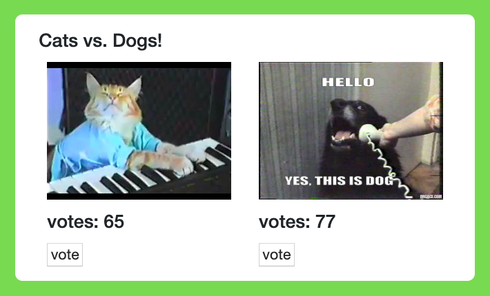

# Load testing Heroku apps using Loadmill

## The demo app

Click here to deploy

## Instructions
1. Deploy the demo app using the Heroku deploy button above ([or this link](https://heroku.com/deploy?template=https://github.com/loadmill/heroku-button-demo/blob/master)).
2. Once the app is deployed (about 45 seconds), click the view button and open the demo app in a new tab.
3. Open the Heroku dashboad by clicking the button at the top right.
4. From the Heroku dashbard, click the the "Loadmill API Testing" add-on to open the Loadmill dashboard.
5. Go to the LOAD TESTS section and click [NEW TEST](https://www.loadmill.com/app/tester).
6. Paste this URL into the black URL input line `<Your App URL>/vote/${__pick_random('dogs','cats')}`
7. Click RUN TEST and run the test with up to 50 users.
8. Go back to your demo app, and watch as votes are comming in.
9. You are now required to adopt the animal that won the vote 🤷‍♂️

---

---

---

## Zeet.co 
The voting app can also be deployed using Zeet.co (But you will have to created a loadmill account manually)

